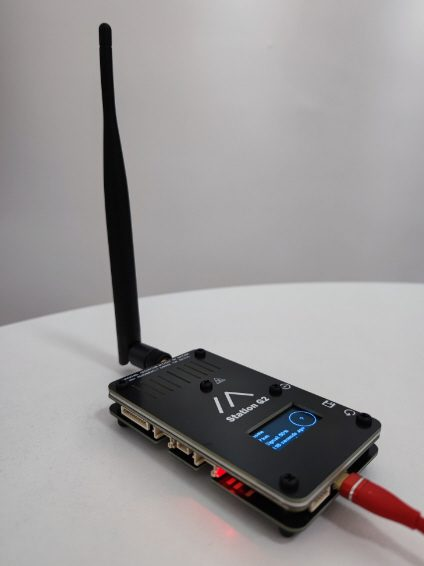
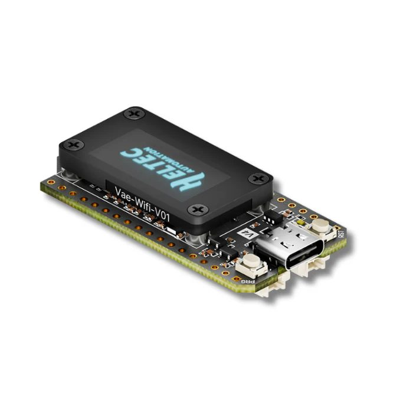
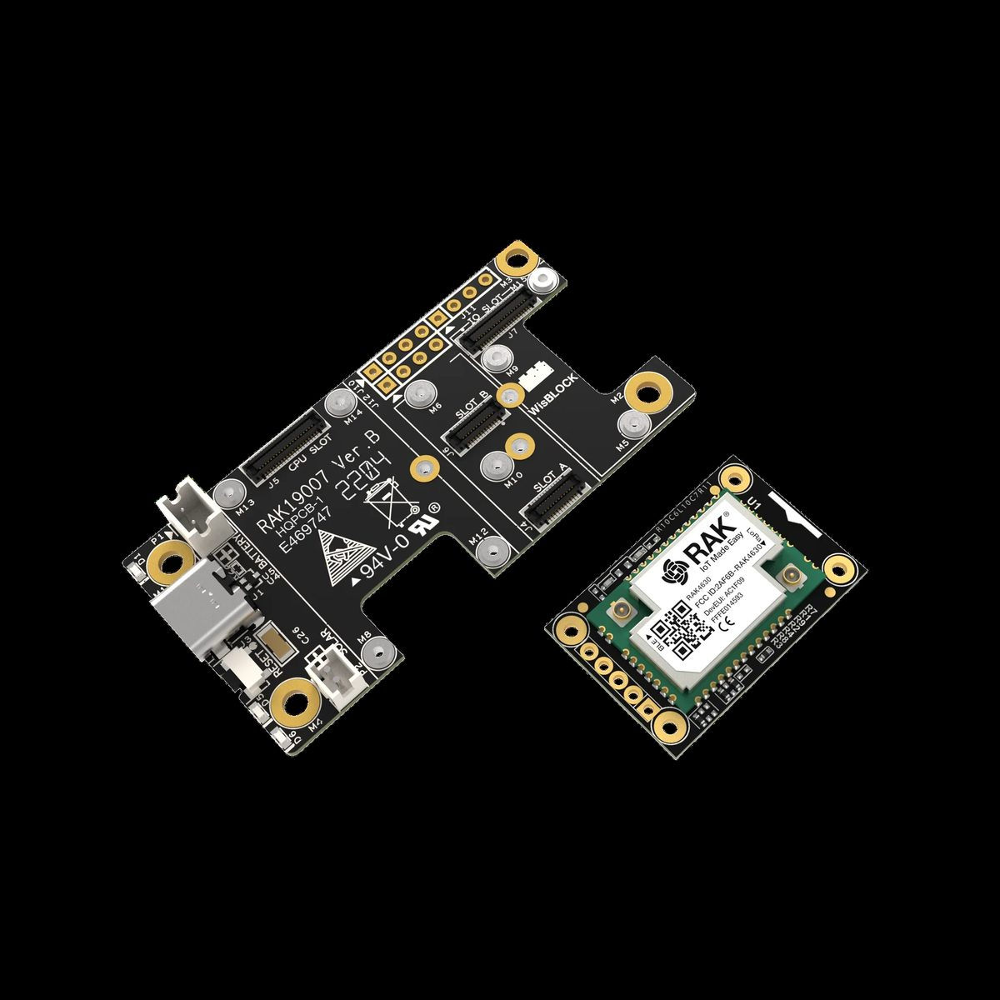
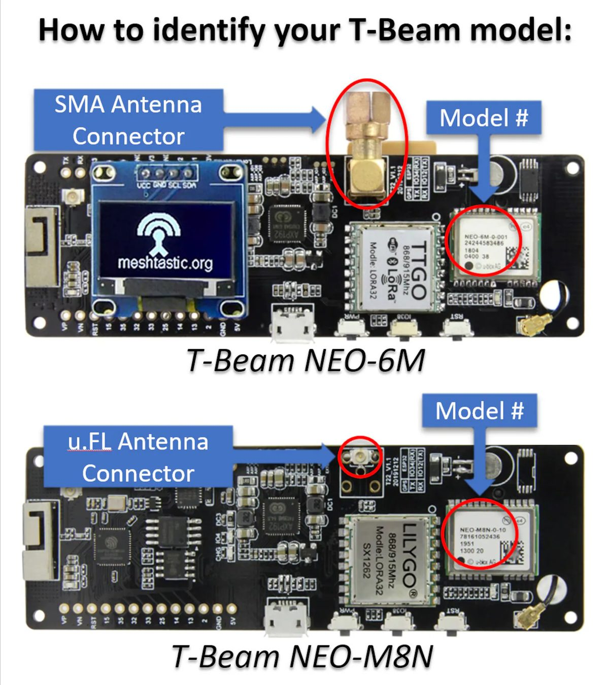
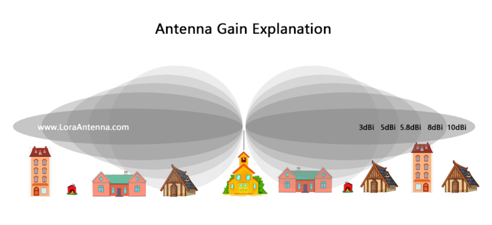
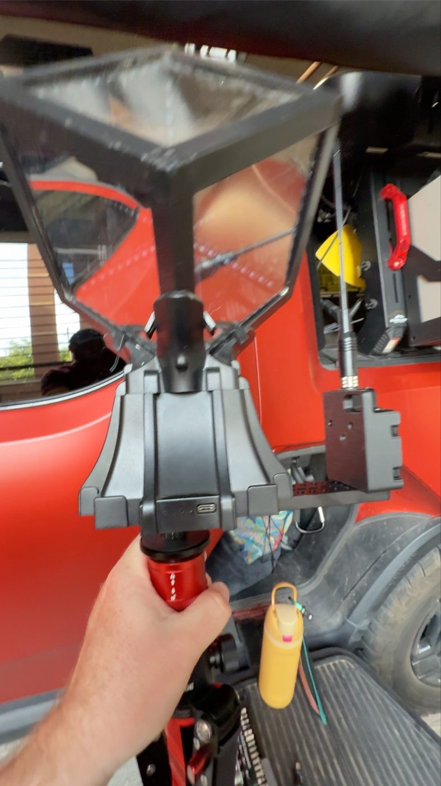
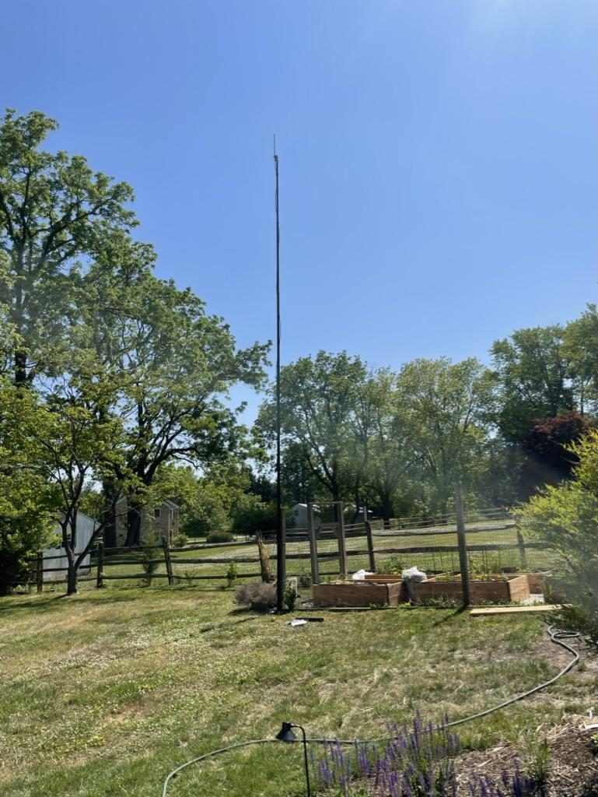
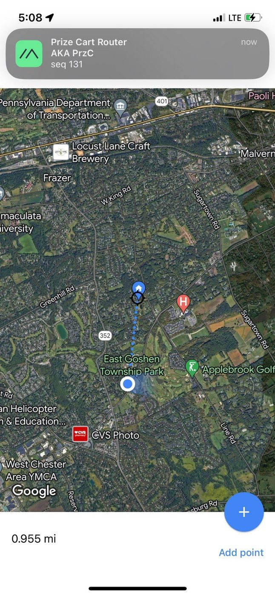

---
hide:
  - navigation
title: Advanced Options
---

# :material-tools: Advanced Options

For folks who want to roll their own hardware, push more power, or experiment with mesh-monitoring software. **Most people don't need this.** A WisMesh Tag or T-Echo and you're set for the Forest.

---

## High-Power Nodes

### B&Q Station G2

The most powerful consumer Meshtastic radio available. Most handhelds put out ~0.25–0.5 watts. The Station G2 puts out **1 watt**, so it reaches dramatically further. Fantastic base station / static node.

{ .ef-advanced-img }

|  |  |
|:--|:--|
| **Pros** | 1W transmit power (vs ~0.5W for most) &middot; Modular — can add GPS, etc. &middot; Wifi (accessible over your local network) &middot; Excellent for a base station |
| **Cons** | Sells out fast &middot; 2–3 week lead time &middot; Power-hungry, no built-in battery &middot; Known to "talk loud, be deaf" (great TX, weaker RX) &middot; Expensive |
| **What you need** | An antenna (upgrade from stock) |
| **Where to buy** | [B&Q Consulting (official)](https://shop.uniteng.com/product/meshtastic-mesh-device-station-edition/){ target=_blank } |
| **Guide** | [Uniteng wiki](https://wiki.uniteng.com/en/meshtastic/station-g2){ target=_blank } |

---

### Heltec V4

Newer and more available than the Station G2. Same 1W output. Open-source friendly.

{ .ef-advanced-img }

|  |  |
|:--|:--|
| **Pros** | Newer, easier to find than Station G2 &middot; 1W transmit power &middot; Modular — add GPS, accessories &middot; Wifi &middot; Great base station &middot; Some folks turn these into solar nodes (with effort) |
| **Cons** | Newer = some early bugs still &middot; Power-hungry, no built-in battery (you have to add one) |
| **What you need** | Antenna (upgrade from stock) &middot; A case &middot; Battery (if portable) |
| **Where to buy** | [Rokland](https://store.rokland.com/products/heltec-wifi-lora-32v4-esp32s3-sx1262-lora-node-meshtastic-lorawan){ target=_blank } &middot; [Etsy (cases & prebuilt)](https://www.etsy.com/search?q=heltec%20v4&ref=search_bar){ target=_blank } |

---

## DIY Build Kits

### RAK Wireless WisBlock Starter Kit

Most flexible DIY option. Pick your case, battery, antenna, modules. Super power-efficient — great base for solar nodes.

{ .ef-advanced-img }

|  |  |
|:--|:--|
| **Pros** | Cheaper than a pre-built &middot; Massively customizable &middot; Super power-efficient (great for solar) |
| **Cons** | Requires time, patience, and some technical chops &middot; Need to source case, battery, antenna separately |
| **Buy the kit** | [RAK Wireless (international)](https://store.rakwireless.com/products/wisblock-meshtastic-starter-kit){ target=_blank } &middot; [Rokland (US distributor)](https://store.rokland.com/products/rak-wireless-wisblock-meshtastic-starter-kit){ target=_blank } |
| **Case options** | [Etsy — Sentinel case](https://www.etsy.com/listing/1705600327/sentinel-rak-wisblock-rak4631-meshtastic){ target=_blank } &middot; [Etsy — mini box](https://www.etsy.com/listing/1671316836/rak-wireless-wisblock-mini-box-for){ target=_blank } &middot; [3D printable](https://www.yeggi.com/q/rak+wisblock/){ target=_blank } |
| **Antenna guide** | [Meshtastic antenna docs](https://meshtastic.org/docs/hardware/antennas/){ target=_blank } |
| **Build guide** | [RAK WisBlock devices on Meshtastic docs](https://meshtastic.org/docs/hardware/devices/rak/){ target=_blank } |

---

### LILYGO TTGO T-Beam

Cheaper than a pre-built, classic DIY option. Pairs well with an 18650 battery.

{ .ef-advanced-img }

|  |  |
|:--|:--|
| **Pros** | Cheap &middot; Customizable with extras (bigger battery, wifi, etc.) |
| **Cons** | Requires time and patience &middot; Needs a case and 18650 battery |
| **Variants** | T-Beam with M8N GPS &middot; T-Beam with M8N + SX1262 (better radio chip — get this one) |
| **Where to buy** | [AliExpress (international)](https://www.aliexpress.com/item/4001287221970.html){ target=_blank } &middot; [Rokland (US)](https://store.rokland.com/products/lilygo-t-beam-v1-1-neo-m8n-gnss-ipex-lora-sx1262-915mhz-wireless-module-wifi-bluetooth-board-q215){ target=_blank } |
| **Cases** | [Etsy NEO-6M case](https://www.etsy.com/listing/1170859229/t-beam-case-neo-6m-for-meshtastic){ target=_blank } &middot; [Etsy NEO-M8N case](https://www.etsy.com/listing/1173559418/t-beam-case-neo-m8n-for-meshtastic){ target=_blank } &middot; [Thingiverse 3D prints](https://www.thingiverse.com/search?q=ttgo+t-beam){ target=_blank } |
| **Batteries** | [Sanyo NCR18650GA 3450mAh 10A — via Rokland](https://store.rokland.com/products/sanyo-ncr18650ga-3450mah-10a-battery-lilygo-ttgo-meshtastic-t-beam){ target=_blank } |
| **Setup video** | [LILYGO T-Beam V1.1 setup on YouTube](https://www.youtube.com/watch?v=mj8yAi7D688){ target=_blank } |

---

## Software for Power Users

### MeshMonitor

A self-hosted web tool that auto-acknowledges messages and runs auto-traceroutes. Great for nerds running infrastructure nodes — typically deployed on a Raspberry Pi at camp. Helps the mesh self-heal by mapping connectivity automatically.

If you're comfortable with self-hosted tools and a Pi, [check out MeshMonitor](https://meshmonitor.org){ target=_blank }.

### MeshSense

Don't want to mess with a Pi? **MeshSense** runs on your laptop (Mac/PC/Linux) and does auto-traceroutes that help strengthen the mesh. Easier on-ramp than MeshMonitor.

[MeshSense by Affirmatech](https://affirmatech.com/meshsense){ target=_blank }

---

## Antennas (Deep Dive)

Recommended antennas:

- [Muzi 17cm Whip](https://muzi.works/products/whip-antenna-17cm){ target=_blank } — handheld upgrade, SMA male, ~$12
- [ALFA 915 MHz 5dBi N-Type 7" Outdoor](https://atlavox.com/products/antenna-for-meshtastic-915mhz-n-type-outdoor-7-5dbi-alfa-aoa-915-5acm){ target=_blank } — base station omni
- [Rokland 5.8 dBi N-Male Omni Outdoor (large)](https://store.rokland.com/collections/802-11ah-wi-fi-halow/products/5-8-dbi-n-male-omni-outdoor-915-mhz-antenna-large-profile-32-height-for-helium-rak-miner-2-nebra-indoor-bobcat){ target=_blank } — permanent outdoor mounts

Tips:

- **Watch out for fakes on Amazon** — antennas are the most counterfeited Meshtastic accessory. Buy from the trusted sources above.
- For base stations, use quality SMA or N-type cable. **Keep the cable short** — every foot adds signal loss.
- **More dB ≠ more coverage.** A directional high-dB antenna in the wrong orientation has less useful coverage than a modest omni.

{ .ef-advanced-img }

---

## Example Setups

Folks in the community have shared their builds. Drop yours in the [EF Discord](https://discord.com/channels/260909643574935553/1111482301730271232){ target=_blank } (not in the Discord? join at [discord.gg/electricforest](https://discord.gg/electricforest){ target=_blank } first) and we'll feature it here.

### Cube Totem Mount

A T-Echo mounted to a [3D-printed bracket](https://makerworld.com/en/models/519487-lilygo-t-echo-bracket-with-1-4-tripod-mount#profileId-435876){ target=_blank } with a tripod-cheese-board adapter, riding on top of a Hyper Cube totem. Visible from across camp and high enough to push range significantly.

{ .ef-advanced-img }

### G2 Mobile Setup

A Station G2 powered via USB-C, with an SMA cable running out to a roof-mounted antenna on a vehicle. Functions as a mobile base station that follows you to and from camp.

### Test Setup (T-Echo + T-Beam)

1× T-Echo handheld + 1× T-Beam base station = easily 1+ mile range hip-height. Dead spots at sharp elevation drops or through dense tree cover. Two-node minimum to start seeing real benefit.

{ .ef-advanced-img }

{ .ef-advanced-img }

---

## Need Help?

    [:fontawesome-brands-discord: Ask in the EF Discord](https://discord.com/channels/260909643574935553/1111482301730271232){ .md-button .md-button--primary target="_blank"}

*Not in the Discord? Join at [discord.gg/electricforest](https://discord.gg/electricforest){ target=_blank } first.*{ .discord-helper }
