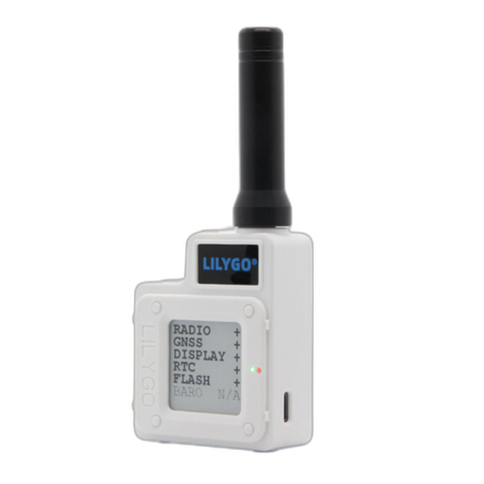
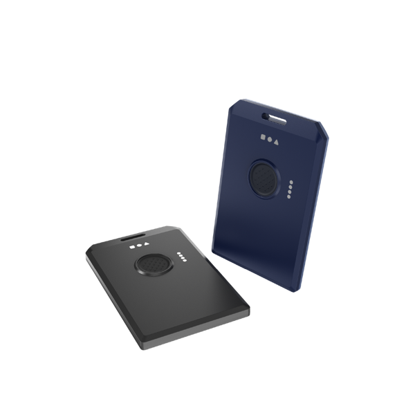
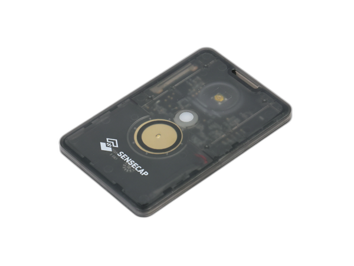
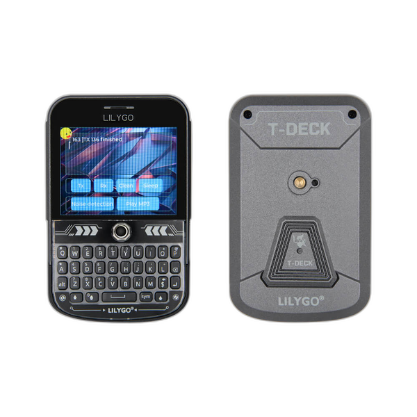

---
hide:
  - navigation
title: Recommended Hardware
---

# :material-radio-handheld: Recommended Hardware for the Forest

You only need one radio to start. There are a lot of options out there — and a **lot of knock-offs**, especially fake antennas on Amazon. Buy from a trusted source.

!!! tip "What to actually buy"
    **For most people, get the [WisMesh Tag](#rak-wismesh-tag-30) (~$30)** — clips to your pack, works out of the box, just charge it and go.

    **If you want a screen on the device itself**, get the **[LILYGO T-Echo](#lilygo-t-echo-60) (~$60)** — readable in direct sun (e-ink), longer range thanks to an external antenna.

    Either of these is a great Forest radio. Order one this week and you're set.

---

## :material-cellphone: Handheld Radios (carry these on you)

### LILYGO T-Echo (~$60)

{ .product-image }

A community favorite. E-ink screen (like a Kindle) so it's readable in direct Michigan sun and barely sips battery. External antenna means longer range than the card-style trackers.

|  |  |
|:--|:--|
| **Pros** | Screen to read messages without your phone &middot; More range than card-style nodes due to external antenna &middot; Ready out of the box &middot; Bluetooth + GPS &middot; Antenna can be upgraded for more range |
| **Cons** | A bit chunky &middot; The reset button is easy to press accidentally (Etsy has cases that cover it) |
| **Where to buy** | [Rokland (~$65, US shipping)](https://store.rokland.com/products/lilygo-ttgo-meshtastic-t-echo-white-lora-sx1262-wireless-module-915mhz-nrf52840-gps-for-arduino){ target=_blank } &middot; [AliExpress (~$60, LILYGO official, ships from China)](https://www.aliexpress.com/item/1005003026107533.html){ target=_blank } |
| **Antenna upgrade** | [Muzi 17cm Whip](https://muzi.works/products/whip-antenna-17cm){ target=_blank } — biggest range boost for $12 |

---

### RAK WisMesh Tag (~$30)

{ .product-image }

Cheapest option that works out of the box. About the size of a credit card, clips to your pack. No screen — you check messages on your phone.

|  |  |
|:--|:--|
| **Pros** | Cheap &middot; Compact, clips to a backpack &middot; Ready to go &middot; Bluetooth + GPS &middot; Better battery than the T-1000e &middot; IP66 waterproof |
| **Cons** | No external antenna, so shorter range than the T-Echo &middot; Recharges via a magnetic pin cable (proprietary) &middot; No screen means you can't easily tell if it's online without checking your phone |
| **Where to buy** | [Rokland ($50, US shipping)](https://store.rokland.com/products/wismesh-tag-from-rakwireless-mokosmart-meshtastic-compatible-card-sized-node-us915-mhz){ target=_blank } &middot; [RAKwireless (~$30)](https://store.rakwireless.com/products/wismesh-tag-meshtastic-gps-lora-tracker-ip66){ target=_blank } &middot; [Amazon ($50)](https://www.amazon.com/RAKwireless-MOKOSmart-Meshtastic-Compatible-Waterproof/dp/B0FYHPTPZD){ target=_blank } |

---

### Sensecap T-1000e (~$30-35)

{ .product-image }

Similar form factor to the WisMesh Tag. Most of us prefer the WisMesh Tag — better battery and a touch more range — but the T-1000e is widely available on Amazon for last-minute pickups.

!!! info "Make sure you buy the T-1000-E"
    There are several T-1000 trackers out there. Get the **T-1000-E** specifically — the others won't work for Meshtastic.

|  |  |
|:--|:--|
| **Pros** | Cheap &middot; Compact, clips to a pack &middot; Ready to go &middot; Bluetooth + GPS &middot; Available on Amazon for last-minute buys |
| **Cons** | No external antenna &middot; Proprietary magnetic charging &middot; No screen |
| **Where to buy** | [Atlavox (~$42, US shipping)](https://atlavox.com/products/t1000-e-meshtastic-radio){ target=_blank } &middot; [Seeed Studio (~$39, official)](https://www.seeedstudio.com/SenseCAP-Card-Tracker-T1000-E-for-Meshtastic-p-5913.html){ target=_blank } &middot; [Amazon (~$59)](https://www.amazon.com/SenseCAP-Card-Tracker-T1000-Meshtastic/dp/B0DJ6KGXKB){ target=_blank } |

---

### LILYGO T-Deck Plus (~$70)

{ .product-image }

If you want a phone-shaped Meshtastic device with no extra parts to source, T-Deck Plus is it. Same 2.8" color screen and physical QWERTY keyboard as the original T-Deck — but now with an **on-board GPS module** and a **built-in 18650 battery slot + charger**. No external GPS dongle, no external battery pack, no cable jungle. Pop in a cell and head to Forest.

|  |  |
|:--|:--|
| **Pros** | Physical QWERTY keyboard &middot; 2.8" color touchscreen &middot; **On-board GPS** (no external module needed) &middot; **Built-in 18650 battery slot + charger** &middot; ESP32-S3 + LoRa SX1262 &middot; Bluetooth + Wifi &middot; Runs standalone without your phone |
| **Cons** | No external antenna &middot; Bigger and heavier than a card-style tracker &middot; Map setup is fiddly (you upload your own map files) |
| **Where to buy** | [LILYGO (~$70, manufacturer)](https://lilygo.cc/en-us/products/t-deck-plus-1){ target=_blank } &middot; [Amazon (~$70)](https://amzn.to/4nz0EUF){ target=_blank } |

---

## :material-radio-tower: Base Station Radios (run these at camp)

A base station is a node you set up at camp and leave running all weekend — ideally mounted high with a good antenna so it extends the mesh for everyone around you. Unlike the handhelds above, these are built to stay put and stay powered.

### PeakMesh (Etsy)

Hand-built Meshtastic base station nodes from a maker on Etsy. A solid option if you want something assembled and ready to mount at camp rather than sourcing boards and enclosures yourself.

|  |  |
|:--|:--|
| **Pros** | Pre-assembled, no soldering &middot; Built for stationary camp use &middot; Supports an external antenna for real range |
| **Cons** | Build options and lead times vary — check the listing |
| **Where to buy** | [PeakMesh on Etsy](https://www.etsy.com/shop/PeakMesh){ target=_blank } |

!!! tip "Pair it with a good antenna and some height"
    The radio matters less than where you mount it. Get the antenna up high and use a short, quality cable. See [Camp Nodes](camp-nodes.md) for the full rundown.

---

## :material-tower-fire: Want to Help the Mesh? Build a Camp Node.

Higher antenna = more range for everyone. If you've got camp infrastructure (a flag pole, a totem, a tall structure), you can host a node up high and dramatically extend the mesh for the whole community.

[See the Camp Nodes guide :material-arrow-right-bold:](camp-nodes.md){ .md-button .md-button--primary }

---

## :material-antenna: Antenna Upgrades

**This is the single best ~$12 you can spend on Meshtastic.** Stock antennas on most handhelds are mediocre. Swap to a real 915 MHz whip antenna and your range jumps significantly.

**Recommended antennas:**

- [Muzi 17cm Whip Antenna](https://muzi.works/products/whip-antenna-17cm){ target=_blank } — community favorite, SMA male, ~$12
- [ALFA 915 MHz 5dBi N-Type Outdoor 7"](https://atlavox.com/products/antenna-for-meshtastic-915mhz-n-type-outdoor-7-5dbi-alfa-aoa-915-5acm){ target=_blank } — for camp base stations
- [Rokland 5.8 dBi N-Male Omni Outdoor](https://store.rokland.com/collections/802-11ah-wi-fi-halow/products/5-8-dbi-n-male-omni-outdoor-915-mhz-antenna-large-profile-32-height-for-helium-rak-miner-2-nebra-indoor-bobcat){ target=_blank } — large outdoor, for permanent mounts

!!! warning "Watch out for fakes"
    The Meshtastic / LoRa antenna world is full of garbage knock-offs on Amazon. Buy from the trusted sources above, or directly from the antenna manufacturer.

**Tips:**

- For base station nodes, use a quality SMA or N-type cable — and **keep it short**. Every foot of cable adds some signal loss.
- "More dB" doesn't always mean "more coverage." A directional high-dB antenna in the wrong orientation can have *less* useful coverage than a modest omni.

---

## :material-cart-outline: Purchasing Tips

!!! warning "Tariffs & Pricing in 2026"
    Most Meshtastic hardware is manufactured in China. Ongoing tariffs on Chinese electronics imports mean **prices can fluctuate** and shipments from overseas may face delays or extra customs fees. Keep this in mind when ordering.

**Buy from US-based dealers when you can.** Shops like [Rokland](https://store.rokland.com){ target=_blank } and [Atlavox](https://atlavox.com){ target=_blank } stock inventory domestically — you get faster shipping, no surprise customs charges, and you're supporting smaller businesses in the Meshtastic community. Prices may be a few dollars more than ordering direct from China, but you skip the 2–4 week wait and tariff uncertainty.

**Tips:**

- **Order early.** Don't wait until the week before Forest. Shipping delays happen, stock sells out, and you'll want time to set up and test your radio.
- **US dealers have already absorbed tariff costs** into their listed prices — what you see is what you pay (plus normal shipping/tax).
- **Direct-from-China sellers** (AliExpress, Seeed Studio) are usually cheaper up front, but delivery takes 2–4 weeks and your package may get hit with import duties at customs.
- **Amazon** is convenient for last-minute buys, but double-check the seller — some listings are resellers charging a premium or shipping knock-off accessories.

---

## Need Help Picking?

Drop a message in the EF Discord Meshtastic thread — we're happy to talk through what fits your setup and budget.

    [:fontawesome-brands-discord: Ask the EF Discord](https://discord.com/channels/260909643574935553/1514411058066882671){ .md-button .md-button--primary target="_blank"}

*Not in the Discord? Join at [discord.gg/electricforest](https://discord.gg/electricforest){ target=_blank } first.*{ .discord-helper }
