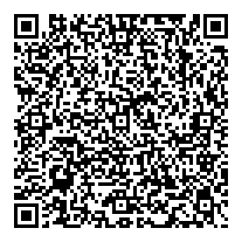

---
hide:
  - navigation
title: Troubleshooting
---

# :material-help-circle: Troubleshooting

Common gotchas and fixes. Still stuck after this? Drop in the [EF Discord](https://discord.com/channels/260909643574935553/1111482301730271232){ target=_blank } — we're happy to help.

---

## "My friends can see each other's messages and I see theirs — but they can't see mine."

This is the most common Meshtastic issue, and it's almost always the same cause: **your node identity got reset** (usually after a firmware update).

Every Meshtastic node has a unique identity stored in **Settings → Security**. Your friends' radios remember this identity and use it to decrypt your messages. If yours changes (because you updated firmware or factory-reset), they're trying to decrypt with the old one.

**Fix:** Have everyone in your squad open the Meshtastic app, tap the **Nodes** tab, find your node, and tap **Delete node**. Their radios will re-fetch your new identity automatically. Done.

**To prevent it next time:**

1. Open the Meshtastic app.
2. **Settings → Security**.
3. Screenshot the encryption value shown there. Save it to your phone's notes app.
4. If a firmware update wipes it, paste the saved value back in.

---

## "I'm not seeing many nodes or messages."

A few things to check:

- **Get higher.** Walls, backpacks, even bodies attenuate the signal. Hold your node up high.
- **Give it time.** The mesh takes a few minutes to "settle" and find optimal paths. Be patient on a fresh setup.
- **Recheck your settings.** Make sure they actually saved — your radio might have been disconnected from the app when you hit Save. Confirm by reopening the settings.
- **Drive around.** If you're testing at home, drive a few blocks and see what nodes pop up. Stationary at home you might just be in a dead spot.
- **Get a second node.** Two-node testing is the minimum to actually verify your setup. Buy a cheap second WisMesh Tag and have a friend take it for a walk.

---

## "My radio won't connect to my phone."

1. **Force quit and reopen** the Meshtastic app.
2. **Toggle Bluetooth** off and on on your phone.
3. **Restart your radio.** Hold the power button to reboot.
4. **Forget and re-pair.** In your phone's Bluetooth settings, forget the Meshtastic device, then re-pair from the app.

---

## "I changed a setting and now everything is broken."

The most common breakage points:

- **Device Role changed to anything other than Client.** Set it back to `Client`. Save. Wait for reboot.
- **Region changed off United States.** Set it back to `United States`. (Required for legal 915 MHz operation in the US.)
- **Frequency Slot changed from 0.** Set it back to `0`.
- **Preset changed from Medium Range - Fast.** Set it back to `Medium Range - Fast`. (Note: the Meshtastic default is `Long Range - Fast` — the Forest community runs Medium Fast instead because we're packed close together. See [Recommended Settings](recommended-settings.md#lora-settings) for the reasoning.)

If you really borked things, factory-reset the radio (long-press button or via the app), then re-scan the [EF channels QR](https://meshtastic.org/e/#CgMSAQEKNBIggr0KuFkTIM9Lp2hj5qlw41jNe9Trl3cJPzSVWlUkwMUaC2NoZ21lLXNxdWFkJQEAAAAKNBIgoU03W9b8s0vpL0IjhBIIHZtuW_sHui3QDhmlaOLflkkaC2ZvcmVzdC1jaGF0JQIAAAAKERIBWxoHV2VhdGhlciUDAAAAEhUIARAEGPoBIAsoBTgBQANIAVAeaAE){ target="_blank" } from scratch. Five-minute fix — preset is baked into the QR, so no manual flip needed.

{ width="240" .channel-qr }

*Scan this from a second phone if you've already nuked the link on yours.*

---

## "My battery is dying way faster than I expected."

- **Turn off device buzzers and vibrations** in External Notifications (see [Recommended Settings](recommended-settings.md#external-notifications-quiet-your-radio)).
- **Increase the Position Broadcast Interval** to 1 hour or longer.
- **Disable Device GPS** and use your phone's GPS instead (saves significant battery).
- **Lower screen brightness** if your radio has a screen.
- **Carry a power bank.** Festival days are long.

---

## "Where are the other Forest folks?"

Mesh propagation depends on density. **Before** the festival kicks off, the mesh is sparse. As more people arrive and turn on radios, the network grows organically. Don't panic if Wednesday afternoon is quiet — by Friday night it'll be lively.

Drop into the [EF Discord Meshtastic thread](https://discord.com/channels/260909643574935553/1111482301730271232){ target=_blank } to find folks who are already on-grounds.

---

## "My GPS isn't getting a fix."

- **Get outside, away from buildings/trees.** GPS needs sky.
- **Be patient on cold start.** First fix can take 5–15 minutes on a fresh radio.
- **Check that GPS is enabled** in Position settings (see [Recommended Settings](recommended-settings.md#position)).
- **Fall back to phone GPS.** If your radio's GPS is unreliable, enable Phone GPS Sharing in the Meshtastic app. Set your phone's location permission for Meshtastic to **Always**.

---

## More Resources

- **[Meshtastic official docs — Introduction](https://meshtastic.org/docs/introduction/){ target=_blank }** — the canonical Meshtastic reference
- **[Best Meshtastic Nodes of 2025 — Ham Radio Crash Course](https://www.youtube.com/watch?v=VGiNDgdkyhs){ target=_blank }** — great hardware comparison video
- **[Find your local Meshtastic community](https://meshtastic.org/docs/community/local-groups/){ target=_blank }** — test your setup with locals before Forest

---

## Still Stuck?

    [:fontawesome-brands-discord: Ask in the EF Discord](https://discord.com/channels/260909643574935553/1111482301730271232){ .md-button .md-button--primary target="_blank"}

